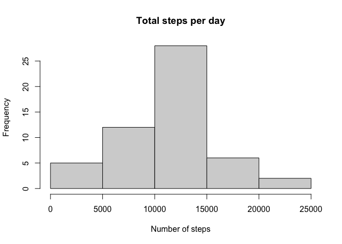
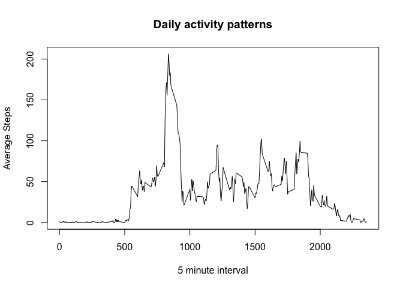
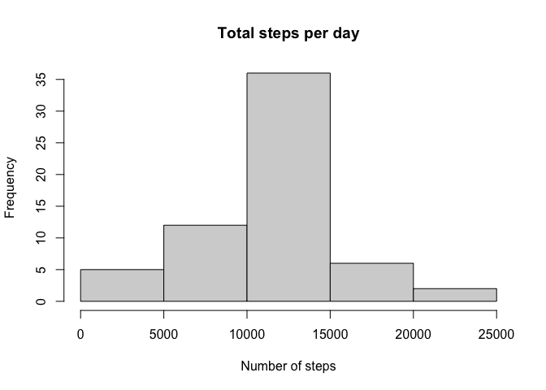
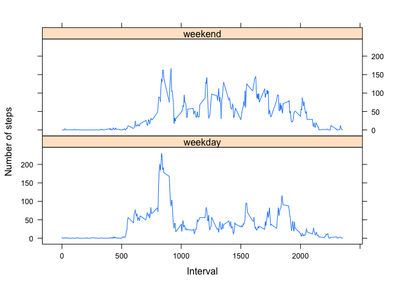

## Loading and preprocessing the data

First the data will be loaded into the variable "data".


```r
data <- read.csv("~/Desktop/RepData_PeerAssessment1/activity.csv")
```

The values in the "date" column were then transformed into a date class


```r
data$date<-as.Date(data$date, "%Y-%m-%d")
```


## What is mean total number of steps taken per day?

Missing values were omitted from the data for this part of the assignment and dplyr package loaded.


```r
data2<-na.omit(data)
library(dplyr)
```

The total steps per day were then calculated and plotted into a histogram.


```r
totalSteps<- data2%>% group_by(date) %>%
        summarize(total = sum(steps))

hist(totalSteps$total, main = "Total steps per day", xlab= "Number of steps", ylab = "Frequency")
```

<!-- -->

The mean and median were then calculated from the total number of steps:


```r
mean(totalSteps$total)
```

```
## [1] 10766.19
```

```r
median(totalSteps$total)
```

```
## [1] 10765
```


## What is the average daily activity pattern?

For this question we will use Data2 since the rows with missing data are already omitted. 

The average steps across days for each 5 minute interval was calculated and then plotted into a time series plot. 


```r
meanStepsInterval <- data2 %>% group_by(interval) %>%
        summarize(avgSteps = mean(steps))

plot(meanStepsInterval$interval, meanStepsInterval$avgSteps, type = "l",
     main = "Daily activity patterns", xlab = "5 minute interval", ylab = "Average Steps")
```

<!-- -->

The interval with the highest average steps across days was calculated


```r
maxRow<- which.max(meanStepsInterval$avgSteps)
maxInt<-meanStepsInterval[maxRow,]
```

The interval with the highest average steps across all days was interval **835** with **206.17** steps.


## Imputing missing values

The total number of missing values was calculated


```r
missingCount<-sum(is.na(data$steps))
```

The total number of missing values in the data set is 2304.

To fill in the missing values, I decided to use the mean for the 5 minute interval using the mutate function in dplyr.  


```r
dataImputed<- data%>% group_by(interval)%>%
        mutate(impsteps= ifelse(is.na(steps), mean(steps, na.rm = TRUE), steps))
```

I then made the new data set that was equal to the old but with all missing values filled in


```r
dataComplete<- dataImputed %>% select(impsteps, date, interval) %>%
        rename(steps=impsteps)

head(dataComplete)
```

```
## # A tibble: 6 x 3
## # Groups:   interval [6]
##    steps date       interval
##    <dbl> <date>        <int>
## 1 1.72   2012-10-01        0
## 2 0.340  2012-10-01        5
## 3 0.132  2012-10-01       10
## 4 0.151  2012-10-01       15
## 5 0.0755 2012-10-01       20
## 6 2.09   2012-10-01       25
```

You can see it is identical to the original data set except for the missing values


```r
head(data)
```

```
##   steps       date interval
## 1    NA 2012-10-01        0
## 2    NA 2012-10-01        5
## 3    NA 2012-10-01       10
## 4    NA 2012-10-01       15
## 5    NA 2012-10-01       20
## 6    NA 2012-10-01       25
```

With the missing values filled in, the histogram of Total steps per day looks like this:


```r
totalSteps2<- dataComplete%>% group_by(date) %>%
        summarize(total = sum(steps))

hist(totalSteps2$total, main = "Total steps per day", xlab= "Number of steps", ylab = "Frequency")
```

<!-- -->

The new mean and median were also calculated:


```r
mean(totalSteps2$total)
```

```
## [1] 10766.19
```

```r
median(totalSteps2$total)
```

```
## [1] 10766.19
```

You can see that filling in the missing values did not change the average steps per day. However, it did skew the median steps per day to be equal to the average. 

## Are there differences in activity patterns between weekdays and weekends?

To determine this, a new variable was created to state if a date was a weekday or weekend.


```r
dataComplete$days <- factor(weekdays(dataComplete$date))
levels(dataComplete$days) <- list(weekday = c("Monday", "Tuesday", "Wednesday", 
                                              "Thursday", "Friday"),
                                  weekend= c("Saturday", "Sunday"))
head(dataComplete)
```

```
## # A tibble: 6 x 4
## # Groups:   interval [6]
##    steps date       interval days   
##    <dbl> <date>        <int> <fct>  
## 1 1.72   2012-10-01        0 weekday
## 2 0.340  2012-10-01        5 weekday
## 3 0.132  2012-10-01       10 weekday
## 4 0.151  2012-10-01       15 weekday
## 5 0.0755 2012-10-01       20 weekday
## 6 2.09   2012-10-01       25 weekday
```

Below is a time series plot for the average number of steps taken on a weekend vs weekday. 


```r
library(lattice)

avgStepsData <- aggregate(dataComplete$steps, list(as.numeric(dataComplete$interval),
                                               dataComplete$days),FUN = "mean")
names(avgStepsData)<- c("interval", "dayType", "avgSteps")


xyplot(avgStepsData$avgSteps ~ avgStepsData$interval | avgStepsData$dayType, 
       layout = c(1, 2), type = "l", 
       xlab = "Interval", ylab = "Number of steps")
```

<!-- -->

From looking at the plot, it seems like steps may be greater and distrubited over greater time intervals, latter in the day on weekends than during weekdays. However, deeper analysis should be completed. 

